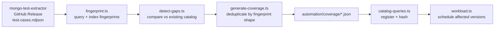

# Mongo Catalog

A comprehensive MongoDB compatibility testing framework that collects query results across multiple MongoDB versions to identify behavioral differences and version-specific quirks.

## Purpose

Mongo Catalog exists to generate the test suite for [monger](https://github.com/konfirm/monger) — a TypeScript implementation of MongoDB's find-query semantics.

The core problem: you cannot write unit tests for a query emulator by hand. The expected output for any non-trivial MongoDB query depends on operator semantics, type coercion rules, and edge-case behaviors that are difficult to reason about in the abstract — and that MongoDB itself has changed subtly across releases. You need to observe what real MongoDB actually does.

Mongo Catalog solves this by mining MongoDB's own jstests for query shapes that would otherwise go untested, remapping those shapes into controlled deterministic test scenarios (so results are comparable across versions), executing them against real MongoDB instances, and recording the exact results as ground truth. Those results become monger's test expectations.

The version tracking is there for the future: once monger reaches find-query completeness, the version ranges in `unified.json` map directly to which MongoDB versions agree on a given behavior — making explicit cross-version handling tractable rather than a guessing game.

## Overview

Mongo Catalog tests MongoDB query operators across different server versions by:
1. **Discovering** all available MongoDB Docker image versions
2. **Generating** test data and queries for various MongoDB operators
3. **Executing** queries against each MongoDB version
4. **Unifying** results to find version-specific behaviors

This helps identify:
- Which operators work consistently across versions
- Where behavioral differences exist between versions
- Error handling variations
- Edge case behaviors

## Architecture

```
mongo-catalog/
├── catalog/              # Query catalogs (test definitions)
│   └── query/
│       ├── common/       # Hand-written operator catalogs (array, bitwise, comparison, ...)
│       ├── coverage/     # Auto-generated from jstest gaps — see Coverage Update Pipeline
│       └── comparison/   # NOT registered — orphaned, see Catalogs section below
├── chore/                # Automation scripts, run in sequence — see docs/CHORES.md
├── scripts/              # Coverage pipeline scripts (fingerprint, detect-gaps, generate-coverage)
├── docs/
│   ├── CHORES.md         # Chore-by-chore mechanics and data flow
│   └── FREQUENCY.md      # Workflow cadence, rate limits, BATCH_SIZE derivation
├── source/               # Shared code
│   └── domain/           # Domain logic (versions, drivers, generators, coverage)
└── automation/           # Generated data — fully git-tracked, not gitignored
    ├── catalog-queries.json   # Registered catalogs
    ├── unified.json           # Cross-version unified results
    ├── coverage/              # Auto-generated coverage catalogs (JSON)
    └── collect/               # Collection results per version
        └── v8/
            └── 8.2.5/         # Results for version 8.2.5
                ├── meta.json
                ├── array.json
                └── ...
```

## Chores (Automation Scripts)

The project uses a chore-based workflow where each script has a specific responsibility. They run in sequence:

```
mongo-docker-images → catalog-queries → workload → mongo-collect → unify
```

| Chore | Command | Responsibility |
|---|---|---|
| `mongo-docker-images.ts` | `npm run update:mongo-versions` | Queries Docker Hub for MongoDB image tags, groups by version/digest, updates each version's `meta.json` |
| `catalog-queries.ts` | `npm run update:catalog-queries` | Discovers catalog files in `catalog/query/**/*.ts`, hashes each export, tracks changes in `automation/catalog-queries.json` |
| `workload.ts` | `npm run update:workload` | Decides which versions need (re-)collection and in what order, via checksum comparison and binary-search bisection per minor series; writes `plan.json` per version and prints the prioritized batch for CI |
| `mongo-collect.ts` | `MONGO_VERSION=x.y.z npm run update:mongo-collect` | Runs a version's pending catalogs against a Dockerized `mongod`, records matches/errors per catalog, updates `meta.json` |
| `unify.ts` | `npm run update:unify` | Aggregates every collected version's results into `automation/unified.json`, compressing consecutive versions with identical results into ranges |
| `backfill-checksums.ts` | `ts-node chore/backfill-checksums.ts` | One-time utility to (re)populate `resultChecksum` fields on existing `meta.json` files; not part of the regular pipeline |

Failed collections back off exponentially (1, 2, 4, 8, 16... days) before being retried, unless the catalog that failed has since changed, which makes the failure immediately eligible again.

For the full mechanics of each chore (exact data shapes, the bisection decision tree, checksum strategy) see **[docs/CHORES.md](./docs/CHORES.md)**. For workflow cadence, external rate limits, and how the batch size was derived, see **[docs/FREQUENCY.md](./docs/FREQUENCY.md)**.

## Coverage Update Pipeline

Coverage catalogs are generated automatically from MongoDB's own jstests twice a week (`.github/workflows/update-coverage.yml`, Wed/Sat 07:00 UTC). They live in `automation/coverage/` and feed directly into the catalog registry.



Each query is fingerprinted together with its index context — `checksum({ query, indices })` — so coverage tracking knows not just *what* query ran but *under what index conditions*. Index shapes are normalised (field names and sort direction are abstracted away), so `{ name: 1 }`, `{ name: -1 }`, and `{ age: 1 }` are all equivalent single-field numeric indices when checking whether a gap is already covered. This keeps the generated index lists minimal and prevents hitting MongoDB's 64-index-per-collection limit.

## Catalogs

Catalogs define test data and queries for specific MongoDB operators. Each catalog exports:

```typescript
{
  operations: Array<Query>,     // Query operations to test
  collection: {
    records: Array<Document>,   // Generated test data
    indices?: Array<Index>      // Optional indices (text, 2dsphere, etc.)
  }
}
```

### Available Catalogs

Catalog files live under `catalog/query/`, but only files exporting a **named** export shaped like `{ operations, collection }` are picked up by `catalog-queries.ts` (default exports are explicitly skipped) — check `automation/catalog-queries.json` for what's actually registered:

| Directory | Origin | Status |
|---|---|---|
| `common/` | Hand-written | Registered — broad, multi-operator catalogs: `array`, `bitwise`, `comparison`, `element`, `evaluation`, `expr`, `geo`, `logical`, `misc`, `modulo`, `text-regex` |
| `coverage/` | Auto-generated | Registered — one catalog per operator family found missing from `common/` by the coverage pipeline (below) — e.g. `and`, `array`, `date`, `elemmatch`, `exists`, `geo`, `in`, `mod`, `nin`, `not`, `or`, `regex`, `sort`, `type`, `where`, and others |
| `comparison/` | Hand-written | **Not registered.** `$eq.ts`, `$eq-implicit.ts`, `$gt.ts`, `$ne.ts` only export a bare `operations` array (no `collection`), so `catalog-queries.ts` doesn't recognize them as catalogs. They currently don't run — this looks like leftover/orphaned code rather than an active third source. |

Exact operation/record counts per catalog change as coverage gaps are found and filled — see `automation/catalog-queries.json` for the current registry, or run `npm run update:catalog-queries` to refresh it.

## Data Generation

The project uses deterministic data generators to ensure consistent test data:

```typescript
const document = compile({
  name: picker('Alice', 'Bob', 'Charlie'),
  age: number(18, 65),
  tags: several('tag1', 'tag2', 'tag3'),
})
```

Generators produce the same data for the same seed, ensuring reproducible tests across versions.

## Usage Workflow

### Initial Setup
```bash
# Install dependencies
npm install

# Discover MongoDB versions
npm run update:mongo-versions

# Register catalogs
npm run update:catalog-queries

# Create workload plans
npm run update:workload
```

### Collect Data
```bash
# Collect for a specific version
MONGO_VERSION=8.2.5 npm run update:mongo-collect

# Collect for multiple versions
MONGO_VERSION=7.0.16 npm run update:mongo-collect
MONGO_VERSION=6.0.20 npm run update:mongo-collect
```

### Analyze Results
```bash
# Unify results across versions
npm run update:unify

# Check unified output
cat automation/unified.json
```

### After Catalog Changes
```bash
# Re-register catalogs (picks up changes)
npm run update:catalog-queries

# Update workload (versions needing re-collection)
npm run update:workload

# Collect for affected versions
MONGO_VERSION=8.2.5 npm run update:mongo-collect

# Re-unify
npm run update:unify
```

## GitHub Actions Integration

The pipeline is split across several workflows rather than one monolithic job:

| Workflow | Trigger | Responsibility |
|---|---|---|
| `versions.yml` | Push to `catalog/**`, `source/**`, `.github/workflows/**`; also Sun/Wed/Sat 07:00 UTC | Runs `update:mongo-versions` + `update:catalog-queries`, commits changes via `commit.yml` |
| `scheduler.yml` | Hourly (plus an extra `:30` run on weekends) | Runs `update:workload`; only invokes `catalog.yml` if there's pending work |
| `catalog.yml` | Called by `scheduler.yml`, or manually | Computes the prioritized batch, runs `update:mongo-collect` for each version in a matrix (`max-parallel: 15`), commits results via `commit.yml` |
| `update-coverage.yml` | Wed/Sat 07:00 UTC | Pulls the latest `mongo-test-extractor` release, runs the coverage pipeline, commits any new `automation/coverage/*.json` |
| `commit.yml` | Called by the above | Runs `update:unify`, then commits and pushes `automation/` |

Each collection job can be triggered manually with `workflow_dispatch`. For exact cadence, the batch-size derivation, and known external rate limits, see **[docs/FREQUENCY.md](./docs/FREQUENCY.md)**.

## Version Support

Mongo Catalog supports MongoDB versions 2.6 through 8.x using multiple driver versions:
- mongodb2 (driver 2.x) for MongoDB 2.6
- mongodb3 (driver 3.x) for MongoDB 3.0-3.6
- mongodb4 (driver 4.x) for MongoDB 4.0-4.4
- mongodb5 (driver 5.x) for MongoDB 5.0-5.1
- mongodb6 (driver 6.x) for MongoDB 5.2-6.0
- mongodb7 (driver 7.x) for MongoDB 6.1-7.x
- mongodb7 also for MongoDB 8.x (current)

## License

ISC
